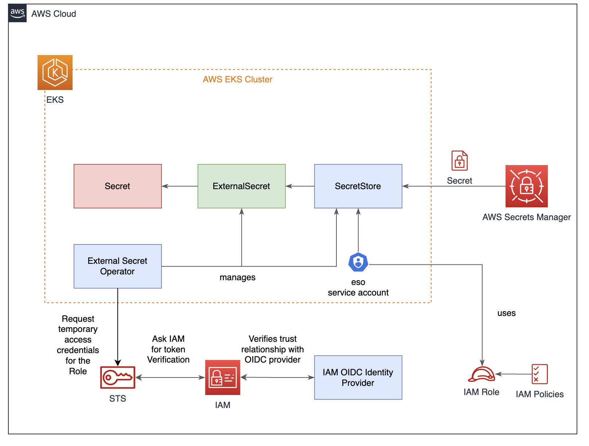

# External Secret Operator Demo

Demo project to use `External Secret Operator` using EKS cluster

# Prerequisites

- EKS  Cluster

# Table of Contents
1. [Architecture Diagram](#architecture-diagram)
2. [Prerequisites](#prerequisites)
    1. [Set Environment Variables](#set-environment-variables)
    2. [Create AWS EKS cluster](#create-aws-eks-cluster)
3. [Install ESO Helm Chart](#install-eso-helm-chart)
4. [IAM roles for service accounts (IRSA)](#iam-roles-for-service-accounts-(irsa))
    1. [Create Policy](#create-policy)
    2. [Create IAM Service Account](#create-iam-service-account)        
5. [Create secret in AWS Secret Manager](#create-secret-in-aws-secret-manager)
6. [Create the external secret resources](#create-the-external-secret-resources)
7. [Cleanup](#cleanup)

## Architecture Diagram



## Prerequisites

### Set environment variables

Before executing any command, set up the following `environment variables`:

```sh
CLUSTER_NAME=gitops-eks-demo
SERVICE_ACCOUNT_NAMESPACE=dev
SERVICE_ACCOUNT_NAME=esodemosa
AWS_REGION=us-east-1

AWS_ACCOUNT_ID=$(aws sts get-caller-identity --query "Account" --output text)
IAM_ROLE_NAME=secretsOberseverRole
```

### Create AWS EKS cluster

Check the [script](./scripts/setup.sh)


## Install ESO Helm Chart

Run the following commands:

```sh
helm repo add external-secrets https://charts.external-secrets.io

helm install external-secrets \
   external-secrets/external-secrets \
   -n external-secrets \
   --create-namespace \
   --set installCRDs=true \
   --set webhook.port=9443
```

## IAM roles for service accounts

### Create Policy

Create the following `AWS policy` to get `GetSecretValue` and `DescribeSecret` permissions:


```json
{
    "Version": "2012-10-17",
    "Statement": [
        {
            "Sid": "VisualEditor0",
            "Effect": "Allow",
            "Action": [
                "secretsmanager:GetSecretValue",
                "secretsmanager:DescribeSecret"
            ],
            "Resource": "arn:aws:secretsmanager:${AWS_REGION}:${IAM_ACCOUNT_ID}:secret:*"
        }
    ]
}
```

Create it with:

```sh
POLICY_ARN=$(aws iam create-policy --policy-name SecretManagerReadPolicy --policy-document file://.policies/policy.json --output text)
```

or if you have created it previously

```sh
POLICY_ARN=$(aws iam list-policies --query 'Policies[?PolicyName==`SecretManagerReadPolicy`].Arn' --output text)
```

### Create IAM Service Account

```sh
eksctl create iamserviceaccount \
    --cluster "${CLUSTER_NAME}" \
    --region "${AWS_REGION}" \
    --name="${SERVICE_ACCOUNT_NAME}" \
    --namespace="${SERVICE_ACCOUNT_NAMESPACE}" \
    --role-name="${IAM_ROLE_NAME}" \
    --role-only \
    --attach-policy-arn="${POLICY_ARN}" \
    --approve    
```

## Create secret in AWS Secret Manager

Use `aws cli` to create the new secret:

```sh
aws secretsmanager create-secret --name dev/godemo/db \
    --description "ESO Demo project" \
    --secret-string '{"username":"<YOUR_USER_HERE>","password":"<YOUR_PASSWORD_HERE>"}' \
    --tags Key=purpose,Value=lab Key=project,Value=eso_demo Key=environment,Value=dev \
    --region us-east-1

```

## Create the external secret resources

First, you need to create the secret store

```yaml
apiVersion: external-secrets.io/v1beta1
kind: SecretStore
metadata:
  name: secretstoredemo
spec:
  provider:
    aws:
      service: SecretsManager
      region: us-east-1
      auth:
        jwt:
          serviceAccountRef:
            name: esodemosa
```

with

```sh
kubectl apply -f eso-manifests/secret-store.yaml
```

Last but not least, create the external secret:

```yaml
apiVersion: external-secrets.io/v1beta1
kind: ExternalSecret
metadata:
  name: eso-demo
spec:
  refreshInterval: 1h
  secretStoreRef:
    name: secretstoredemo
    kind: SecretStore
  target:
    name: eso-demo
    creationPolicy: Owner
  data:
  - secretKey: db-username
    remoteRef:
      key: dev/godemo/db
      property: username
  - secretKey: db-password
    remoteRef:
      key: dev/godemo/db
      property: password
```

## Cleanup

Execute the following [script](./scripts/cleanup.sh) to cleanup all resources created
